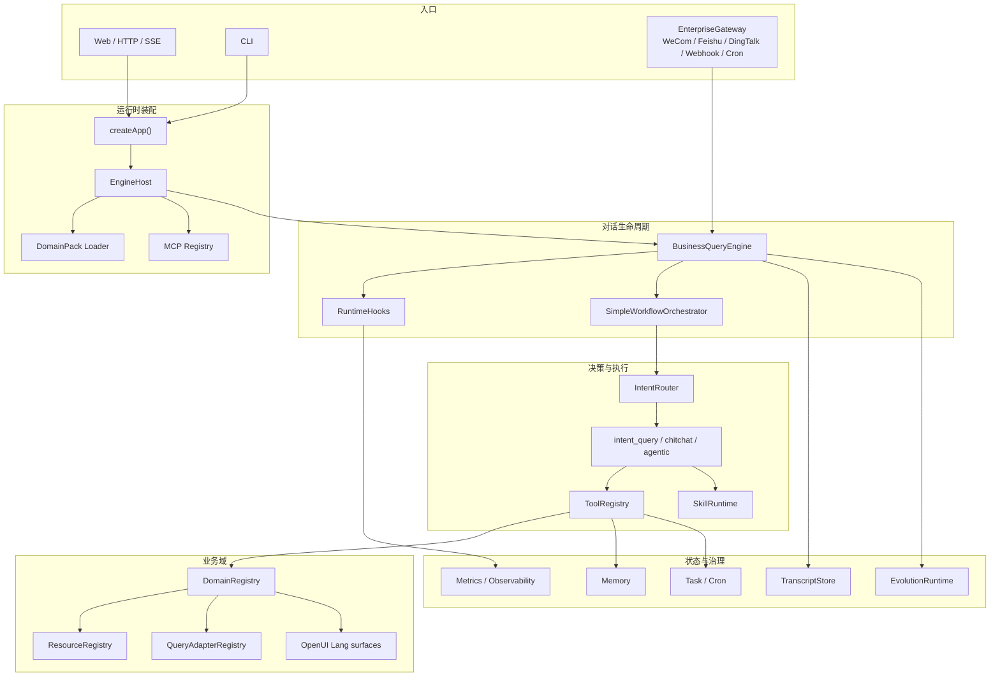

# Enterprise Agent Runtime

这是一个支持多领域业务模型的企业级 Agent Runtime，用来搭建能接入企业数据、工具、权限和流程的内部智能助手。

它通过 DomainPack 承载不同业务领域的知识、数据、工具和工作流，并通过统一的路由、权限治理、结构化 UI、会话记忆、任务自动化、渠道网关和观测能力，把业务问答、数据查询、流程草稿、经营分析和人机协同动作串成完整闭环。

内置领域能力：

| Domain | 目录 | 说明 |
|---|---|---|
| `core` | `src/domains/core` | 通用组织、订单、销售报表等基础能力 |
| `dealer` | `src/domains/dealer` | 汽车经销商经营、库存、线索、财务、售后等场景 |
| `attendance` | `src/domains/attendance` | 请假查询和请假流程 |
| `cloud_commodity` | `src/domains/cloud-commodity` | 云商品平台，覆盖产品化、Offer/SKU/计费、发布审批、GTM、容量、SRE、GMV、续约和客户自助询价 |
| `retail-demo` | `src/domains/retail-demo` | 零售参考域，用于验证 DomainPack 扩展机制 |

## 读文档入口

| 需求 | 文档 |
|---|---|
| 部署上线 | [DEPLOY.md](DEPLOY.md) |
| HTTP / SSE 接口契约 | [API.md](API.md) |
| 角色和权限 | [ROLES.md](ROLES.md) |
| 推荐命令和意图字典 | [COMMANDS.md](COMMANDS.md) |
| 当前架构图 | [docs/current-project-architecture.md](docs/current-project-architecture.md) |
| Domain 隔离方案 | [docs/domain-isolation-plan.md](docs/domain-isolation-plan.md) |
| 云商品演示脚本 | [docs/cloud-commodity-ecs-demo-script.md](docs/cloud-commodity-ecs-demo-script.md) |
| 云商品验收报告 | [docs/cloud-commodity-browser-acceptance-report.md](docs/cloud-commodity-browser-acceptance-report.md) |
| 云商品工作手册 | [docs/cloud-commodity-workbook/README.md](docs/cloud-commodity-workbook/README.md) |

## 当前能力

- **统一运行时**：`EngineHost` 组装 LLM、DomainRegistry、ToolRegistry、IntentRouter、Handlers、Skills、Memory、Task、Cron、Gateway、Observability。
- **多 DomainPack**：业务域通过 `domain-pack.ts` 声明资源、工具、权限、路由规则、查询适配器、OpenUI surface、提示词和评测。
- **Domain 隔离**：请求可传 `domain_id` / `selected_domain`，路由、工具、资源、OpenUI surface 和推荐命令都会按当前业务域过滤。
- **OpenUI Lang**：后端输出结构化 UI envelope，支持表格、指标卡、风险列表、图表、business brief、产品发布表单等组件，并兼容旧 A2UI 路径。
- **Agentic 工具调用**：`agentic` handler 可以基于可暴露工具做多步骤计划、调用、总结，并受权限、确认、超时、重试和 domain policy 约束。
- **企业入口**：HTTP Web、CLI、WeCom、Feishu、DingTalk、Webhook、Cron 通过 `EnterpriseGateway` 进入同一条业务链路。
- **状态与治理**：Transcript、Session、Memory、Task、UserCron、EvolutionRuntime、Metrics、Langfuse adapter 都是独立模块，可按部署阶段开启。
- **云商品领域能力**：`cloud_commodity` 提供完整样例数据、角色、评测、浏览器验收截图、工作手册、文章和 PPT 交付物。

## 架构概览



## 快速开始

要求：

- Node.js `>=18`，推荐 Node.js 20 LTS
- npm
- 至少一个 OpenAI 兼容的 LLM API Key。如果不配置，服务可以启动，但真实模型回答会失败或降级

```bash
npm install

# postinstall 会自动创建运行时目录，并在缺失时复制 .env.example -> .env
# 编辑 .env，至少配置：
# LLM_API_KEY=你的_key
# LLM_BASE_URL=https://api.minimaxi.com/v1
# LLM_MODEL=MiniMax-M2.7

npm start
```

访问：

```text
http://localhost:3000
```

开发热启动：

```bash
npm run start:dev
```

生产式本地启动：

```bash
npm run server:build
```

附件上传需要 S3 兼容对象存储。只做聊天试用时可以不启用；要联调附件，可先起本地 MinIO：

```bash
docker compose -f docker-compose.attachments.yml up -d
```

## 常用试用账号

| user_id | 角色 | 推荐 domain |
|---|---|---|
| `cloud_pm_001` | 云商品 PM | `cloud_commodity` |
| `cloud_exec_001` | 云业务管理层 | `cloud_commodity` |
| `cloud_sales_001` | 云解决方案销售 | `cloud_commodity` |
| `cloud_customer_001` | 客户自助服务 | `cloud_commodity` |
| `store_gm_001` | 汽车门店总经理 | `dealer` |
| `sales_manager_001` | 汽车销售经理 | `dealer` |
| `sales_001` | 汽车销售顾问 | `dealer` |
| `retail_user_001` | 零售参考用户 | `retail-demo` |

云商品示例问题：

```text
我要把 ECS GPU 训练实例接入云商品平台，支持华东 1 和新加坡，按量和包月售卖。请生成商品模型、SKU、计费项、购买页字段和 IPD 上架检查清单。
```

```text
ECS GPU 商品本月 GMV 目标完成得怎么样？毛利、交付、容量和客户风险分别谁负责？
```

汽车经销商示例问题：

```text
汉EV 卖得还行但毛利好像不太行，看下原因。
```

## HTTP 接口

非流式：

```bash
curl -X POST http://127.0.0.1:3000/api/openui/chat \
  -H "Content-Type: application/json" \
  -d '{
    "user_id": "cloud_pm_001",
    "domain_id": "cloud_commodity",
    "message": "生成 rel_ecs_gpu_train_202606 的发布审批摘要，重点看价格、容量、SLA 和回滚检查点。",
    "debug": true
  }'
```

流式 SSE：

```bash
curl -N -X POST http://127.0.0.1:3000/api/openui/chat/stream \
  -H "Content-Type: application/json" \
  -d '{
    "user_id": "cloud_exec_001",
    "domain_id": "cloud_commodity",
    "message": "本月云商品经营风险给我一版老板简报。"
  }'
```

常用只读接口：

```bash
curl http://127.0.0.1:3000/health
curl http://127.0.0.1:3000/ready
curl "http://127.0.0.1:3000/api/user-context?user_id=cloud_pm_001"
curl "http://127.0.0.1:3000/api/recommended-commands?user_id=cloud_pm_001&domain_id=cloud_commodity"
curl "http://127.0.0.1:3000/api/tools/catalog?domain=cloud_commodity.catalog"
curl http://127.0.0.1:3000/api/openui/capabilities
```

兼容路径：

- `/api/chat` 等价于 `/api/openui/chat`
- `/api/chat/stream` 等价于 `/api/openui/chat/stream`
- `/api/a2ui/*` 保留 legacy A2UI 兼容

多轮对话：请求体里复用同一个 `session_id`。

## 关键环境变量

| 变量 | 说明 | 默认值 |
|---|---|---|
| `LLM_API_KEY` | 默认模型调用凭证 | 空 |
| `LLM_BASE_URL` | OpenAI 兼容端点 | `https://api.minimaxi.com/v1` |
| `LLM_MODEL` | 默认模型 | `MiniMax-M2.7` |
| `LLM_DECISION_*` | 路由判别模型配置 | 继承 `LLM_*` |
| `LLM_ANSWER_*` | 最终回答模型配置 | 继承 `LLM_*` |
| `LLM_PROMPT_CACHE` | Prompt cache，`auto` 或 `off` | `auto` |
| `PORT` / `HOST` | HTTP 监听 | `3000` / `0.0.0.0` |
| `OPENUI_USER_QPM` | 单用户每分钟请求限制 | `30` |
| `OPENUI_IP_QPM` | 单 IP 每分钟请求限制 | `60` |
| `OPENUI_STREAMS_PER_USER` | 单用户并发 SSE 流限制 | `3` |
| `CHAT_STREAM_TIMEOUT_MS` | 单次流式回答超时 | `180000` |
| `SSE_HEARTBEAT_MS` | SSE 心跳间隔 | `15000` |
| `OPENUI_AUTH_DISABLED` | 本地开发可关闭鉴权 | `npm run server` 默认设为 `1` |
| `WECOM_MODE` | 企业微信 real/mock | `mock` |
| `FEISHU_APP_ID` / `FEISHU_APP_SECRET` | 飞书渠道配置 | 空 |
| `OBSERVABILITY_ENABLED` | 是否启用 Langfuse adapter | `true` |
| `LANGFUSE_HOST` / `LANGFUSE_PUBLIC_KEY` / `LANGFUSE_SECRET_KEY` | Langfuse 配置 | 空 |
| `S3_*` | 附件对象存储配置 | 空 |

生产环境不要开启 `OPENUI_AUTH_DISABLED`。

## 目录结构

```text
src/
  app.ts                    createApp() 和 MCP 挂载入口
  engine/host/              EngineHost 运行时装配层
  server/                   HTTP、SSE、OpenUI 页面、附件上传
  router/                   IntentRouter、命令、确定性规则
  handlers/                 intent_query、agentic、chitchat 等执行层
  tools/                    ToolRegistry、工具治理、业务工具、任务/cron/memory 工具
  domains/                  core、dealer、attendance、cloud-commodity、retail-demo
  openui-lang/              OpenUI Lang 协议、组件契约、渲染和 surface 生成
  runtime/                  BusinessQueryEngine、上下文、hooks、workspace
  gateway/                  Web/WeCom/Feishu/DingTalk/Webhook/Cron 渠道
  transcript/ memory/ cron/ evolution/ security/
  eval/                     回归、冒烟、灰度验收脚本

data/
  cloud-commodity/          云商品 mock 数据
  domains/*/intent-codes/   各 domain 的 intent manifest
  dealer-*.json             经销商 mock 数据
  users.json                内置用户和权限
  recommended-commands.json 前端推荐命令

docs/
  cloud-commodity-*         云商品演示、验收、工作手册和交付物
  current-project-architecture.md
  domain-isolation-plan.md
  operations-runbook.md
```

## 新增 DomainPack

最小路径：

1. 在 `src/domains/<your-domain>/` 新建 `domain-pack.ts`。
2. 声明资源、工具、权限、确定性路由、field labels、OpenUI surface 和提示词片段。
3. 在 `data/domains/<your-domain>/intent-codes/` 放 intent manifest。
4. 放置业务数据文件，或实现 QueryAdapter 对接外部数据源。
5. 增加对应 eval，至少覆盖路由、权限、数据查询和 domain isolation。

`src/domains/available-packs.ts` 会自动扫描 `src/domains/*/domain-pack.ts`。静态 `AVAILABLE_PACKS` 只作为兼容 fallback。

## 验证命令

基础检查：

```bash
npm run typecheck
npm run build:ts
npm run config:check
```

核心 smoke：

```bash
npm run smoke
npm run session:smoke
npm run business:runtime
npm run openui:adapter
npm run eval:tool-catalog
npm run eval:gateway
```

云商品灰度验收：

```bash
npm run eval:cloud-commodity
npm run eval:cloud-data-dictionary
npm run eval:cloud-user-stories
npm run eval:domain-isolation
```

运行中的云商品服务可用：

```bash
BASE_URL=http://localhost:3000 node scripts/verify-cloud-ecs-demo.mjs
```

## 部署建议

完整后端更适合部署为长驻 Node 服务，而不是纯 serverless 函数。推荐：

- 小范围灰度：1 核 2G ECS 可以跑 Web 试用环境，但建议只开放少量用户、关闭自部署观测和本机对象存储。
- 稳定试点：2 核 4G 起步，Node 进程用 systemd/PM2 守护，Nginx/ALB 做 HTTPS 反代。
- 附件：接阿里云 OSS、S3 或 MinIO，不要依赖本机临时文件。
- 观测：Langfuse 自部署建议独立机器或独立容器栈。
- 前端静态文章/工作手册可以单独上 Vercel，Agent 后端建议走 ECS、Cloud Run、容器服务或其他长驻运行环境。

详细步骤见 [DEPLOY.md](DEPLOY.md)。

## 常见问题

**只想灰度一个 domain pack 怎么办？**

当前代码会加载所有内置 pack，但请求侧可以通过 `domain_id` 做强隔离。若要发布成单域灰度环境，建议增加 `ENABLED_DOMAIN_PACKS=core,cloud_commodity` 一类 allowlist，或在部署分支中只保留目标域。

**为什么要传 `domain_id`？**

它是多业务域隔离的显式边界。路由可能因为“客户、风险、毛利、库存”等通用词产生歧义，`domain_id` 能让路由、工具、资源和 OpenUI surface 都约束在当前场景。

**没有 LLM Key 能跑吗？**

服务可以启动，确定性路由和本地数据自检可以跑；真实自然语言回答需要配置 OpenAI 兼容模型。

**README 之外最该看哪份材料？**

如果是开发者，先看 [docs/current-project-architecture.md](docs/current-project-architecture.md)。如果是灰度演示，先看 [docs/cloud-commodity-ecs-demo-script.md](docs/cloud-commodity-ecs-demo-script.md) 和 [docs/cloud-commodity-browser-uat-testset.md](docs/cloud-commodity-browser-uat-testset.md)。
