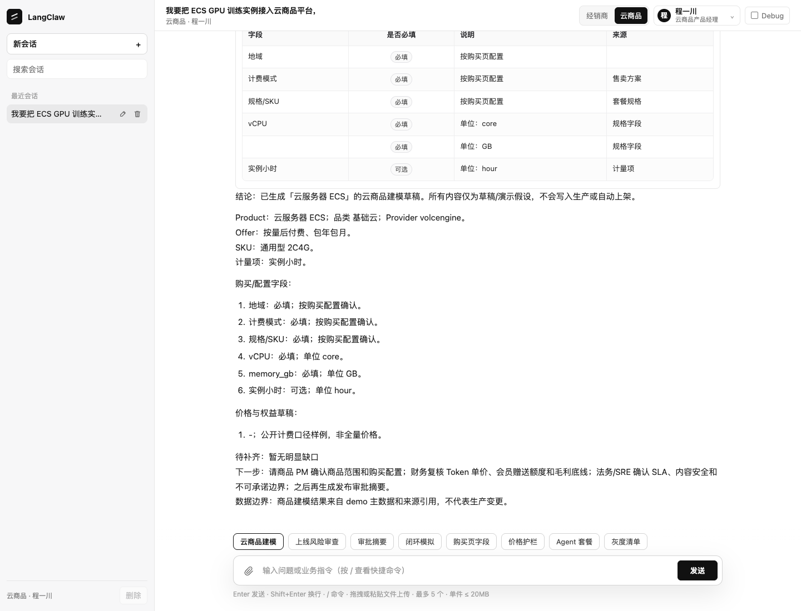
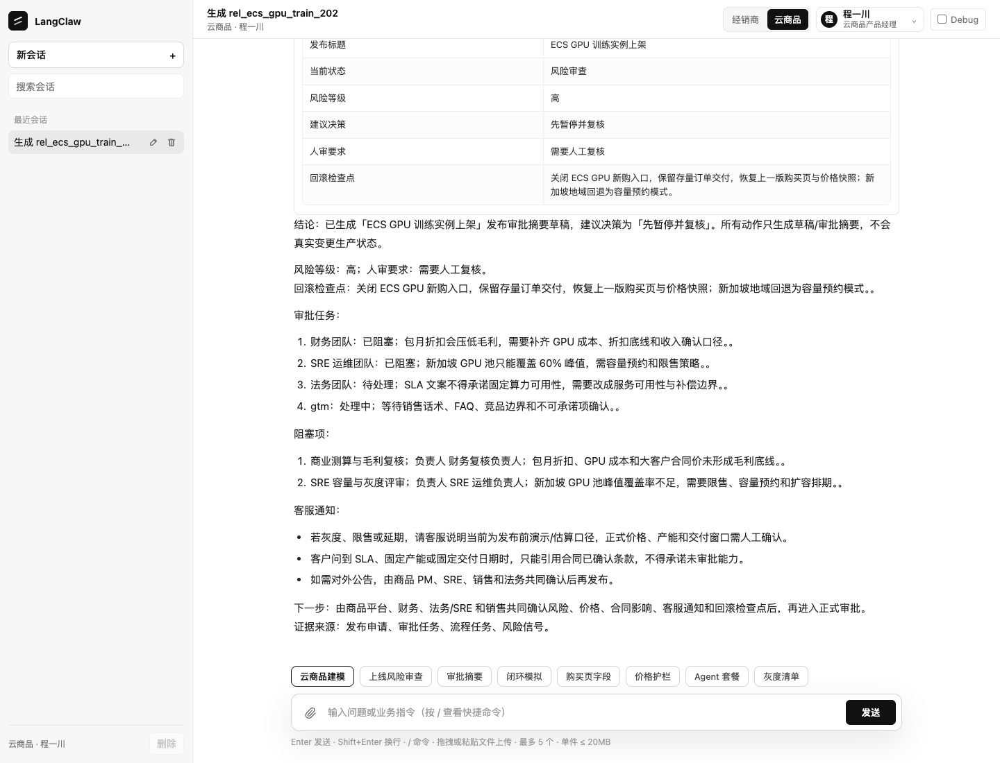
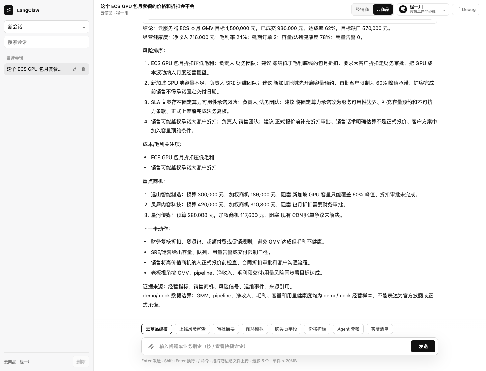
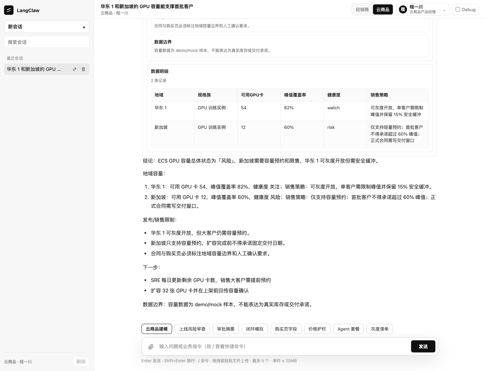
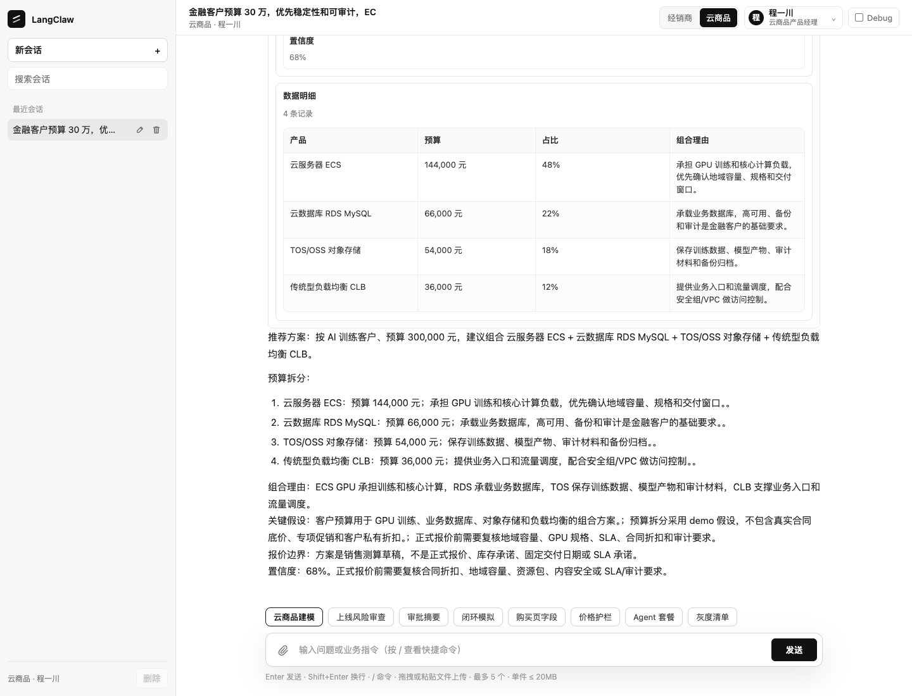
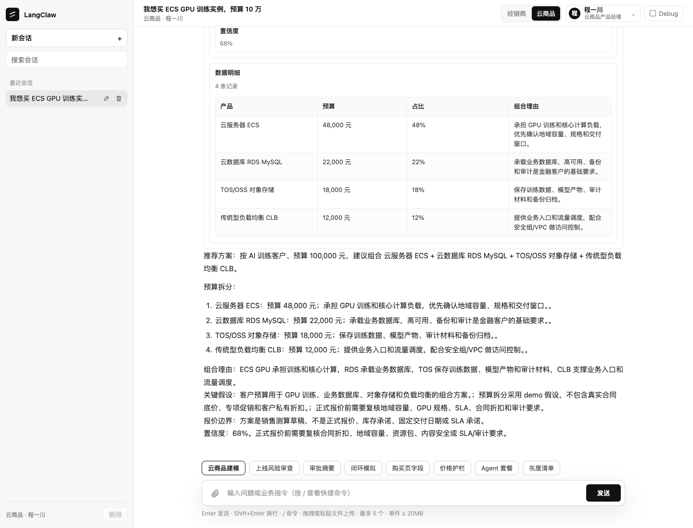
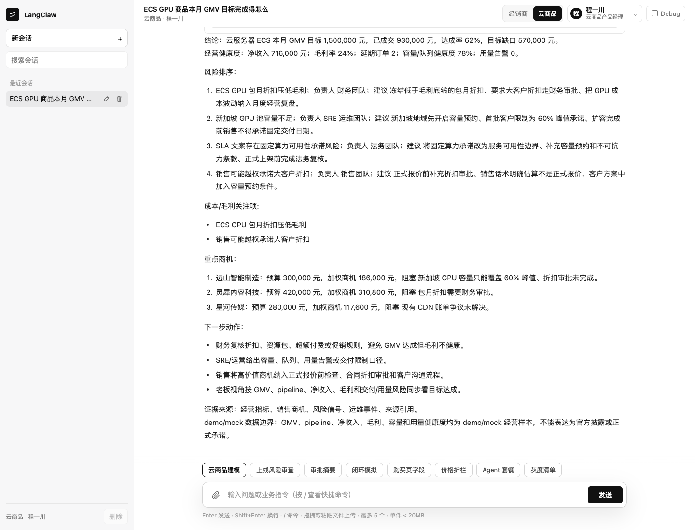
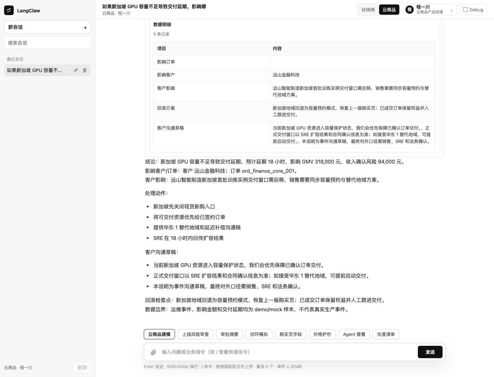
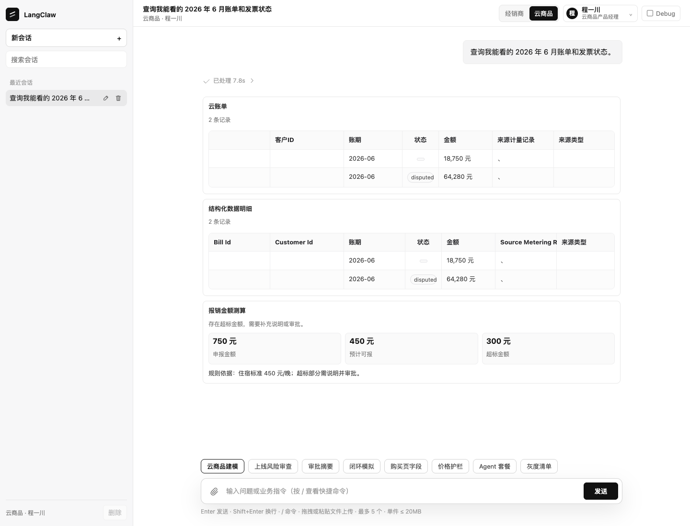
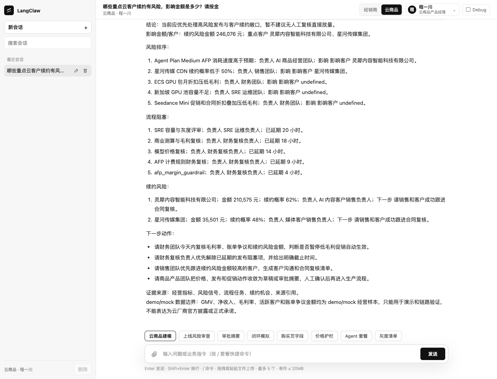

# 云商品用户场景验收截图集

生成时间：2026/6/20 14:20:27

| # | 角色 | 场景 | 结果 | OpenUI卡片数 | 命中关键词 | 截图 |
|---|---|---|---|---:|---|---|
| 1 | 商品 PM | ECS GPU 产品化/IPD 上架检查 | 通过 | 1 | 商品模型、SKU、计费项、购买页字段、IPD | [01-pm-ecs-ipd.png](./01-pm-ecs-ipd.png) |
| 2 | 商品 PM | 发布审批摘要与回滚检查点 | 通过 | 1 | 审批、风险、回滚、人工 | [02-pm-release-approval.png](./02-pm-release-approval.png) |
| 3 | 财务 BP | 包月折扣与毛利护栏 | 通过 | 7 | 毛利、折扣、审批 | [03-finance-margin.png](./03-finance-margin.png) |
| 4 | SRE | 区域容量与灰度限售 | 通过 | 7 | 容量、新加坡、限售、灰度 | [04-sre-capacity.png](./04-sre-capacity.png) |
| 5 | 云销售 | 金融客户 30 万组合方案 | 通过 | 6 | 30、ECS、RDS、TOS、正式报价 | [05-sales-solution.png](./05-sales-solution.png) |
| 6 | 客户自助 | 预算询价与非正式报价边界 | 通过 | 6 | 10、华东、包月、非正式报价 | [06-customer-self-quote.png](./06-customer-self-quote.png) |
| 7 | 业务负责人/老板 | GMV 目标与经营健康度 | 通过 | 7 | GMV、毛利、交付、负责人 | [07-boss-gmv-cockpit.png](./07-boss-gmv-cockpit.png) |
| 8 | 运维/SRE | 新加坡容量不足的经营影响 | 通过 | 6 | 新加坡、延期、GMV、回滚、客户沟通 | [08-ops-incident-impact.png](./08-ops-incident-impact.png) |
| 9 | 客户/财务 | 账单与发票争议 | 通过 | 3 | 账单、发票、2026 | [09-billing-dispute.png](./09-billing-dispute.png) |
| 10 | 老板/客户成功 | 续约风险闭环 | 通过 | 7 | 续约、金额、下一步、负责人 | [10-renewal-risk.png](./10-renewal-risk.png) |

## 截图

### 1. ECS GPU 产品化/IPD 上架检查

### 2. 发布审批摘要与回滚检查点

### 3. 包月折扣与毛利护栏

### 4. 区域容量与灰度限售

### 5. 金融客户 30 万组合方案

### 6. 预算询价与非正式报价边界

### 7. GMV 目标与经营健康度

### 8. 新加坡容量不足的经营影响

### 9. 账单与发票争议

### 10. 续约风险闭环

