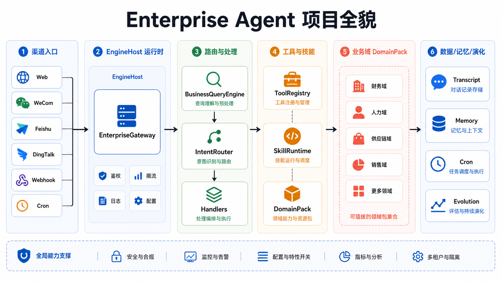
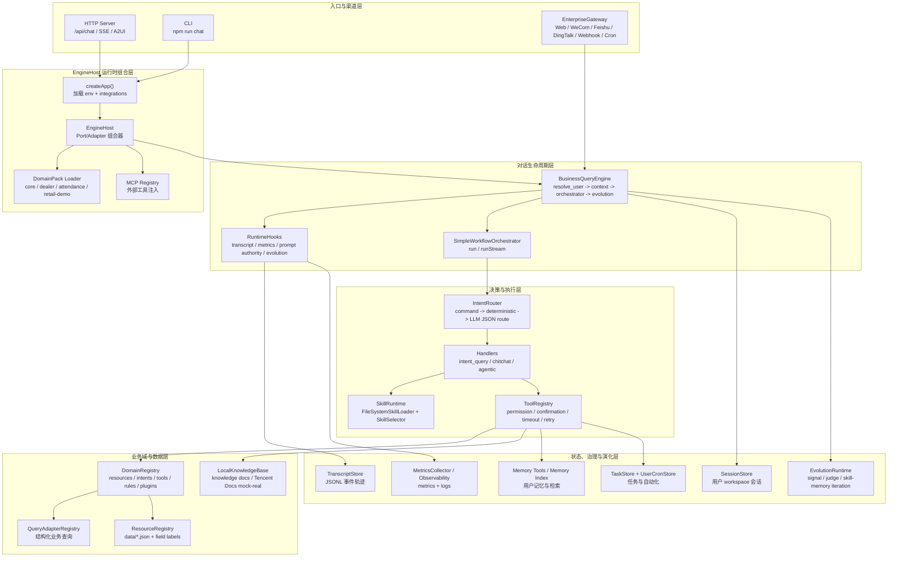
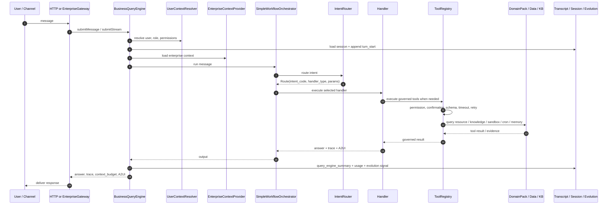
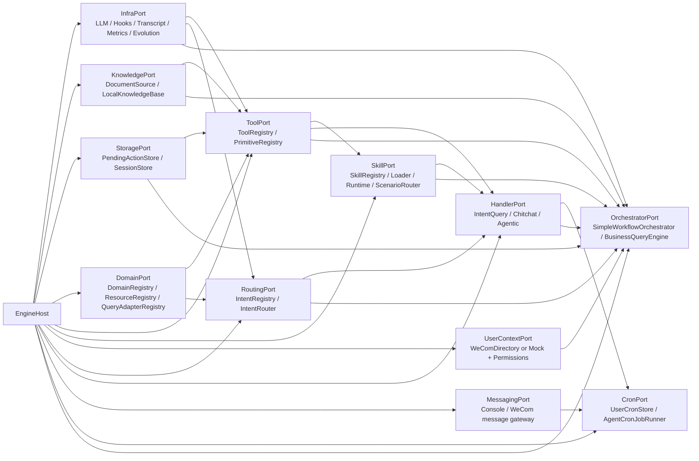
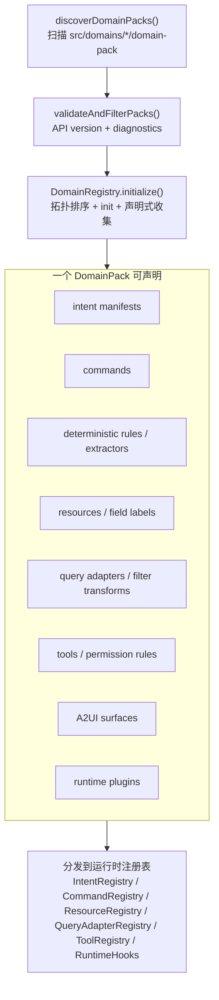

# 当前项目全貌与功能架构

分支：`feat/integration-all`

本项目是一个面向企业内部业务场景的 TypeScript Agent Runtime。当前代码已经从“单一业务 Agent”演进为一套可扩展运行时：多渠道入口统一进入 `BusinessQueryEngine`，再由 `EngineHost` 组装路由、Handler、工具、技能、业务域、记忆、任务、Cron、演化和观测能力。

## 项目全貌图

## 总体分层架构

## 单轮消息处理链路

## EngineHost 装配关系

## DomainPack 扩展机制

## 当前主要功能域

| 层级 | 关键模块 | 职责 |
|---|---|---|
| 入口 | `src/server/http.ts`, `src/cli.ts`, `src/gateway/*` | HTTP、SSE、A2UI、CLI、多 IM/Webhook/Cron 渠道接入 |
| 运行时 | `src/app.ts`, `src/engine/host/*`, `src/runtime/*` | 应用启动、EngineHost 装配、QueryEngine 生命周期、Hooks、上下文组装 |
| 决策 | `src/router/*`, `data/intent-codes/*` | 命令、确定性规则、LLM 意图路由、参数校验与降级 |
| 执行 | `src/handlers/*`, `src/agent/*`, `src/agentic/*` | 结构化查询、闲聊、自主规划、多步骤工具调用、子 Agent |
| 工具 | `src/tools/*`, `src/sandbox/*`, `src/mcp/*` | 工具注册、权限治理、确认流、重试超时、沙箱、MCP 外部工具 |
| 技能 | `src/skills/*`, `workspace/skills/*` | Skill 注册、选择、严格工作流、Agentic skill view |
| 业务域 | `src/domains/*`, `src/resources/*`, `src/query/*` | core、dealer、attendance、retail-demo 等业务能力声明和查询适配 |
| 知识 | `src/rag/*`, `docs/knowledge/*` | 本地知识库、腾讯文档 mock/real source、制度问答 |
| 状态 | `src/transcript/*`, `src/memory/*`, `src/tasks/*`, `src/cron/*` | 会话轨迹、记忆、任务、高水位、用户自动化 |
| 治理 | `src/evolution/*`, `src/security/*`, `src/eval/*` | 演化闭环、鉴权限流观测、回归/冒烟验证 |

## 一句话总结

当前分支的架构重心是 `EngineHost + DomainPack + ToolRegistry + BusinessQueryEngine`：`EngineHost` 负责把运行时能力组装起来，`DomainPack` 负责让业务能力可插拔，`ToolRegistry` 负责把所有执行能力纳入权限和治理，`BusinessQueryEngine` 负责把每一轮消息变成可追踪、可压缩、可演化的完整生命周期。
