# 企业级AI超级助理：售前图片集脚本

这套图片集用于售前沟通。建议不要一开始讲代码模块，而是按“客户痛点 → 产品机制 → 业务价值 → 落地路径”的顺序讲。

核心定位：

> 我们把大模型升级成一位企业级AI超级助理，让它能接入业务系统、理解岗位权限、调用内部工具、自动跟进任务，并且全过程可审计、可扩展、可演化。

## 01. 封面

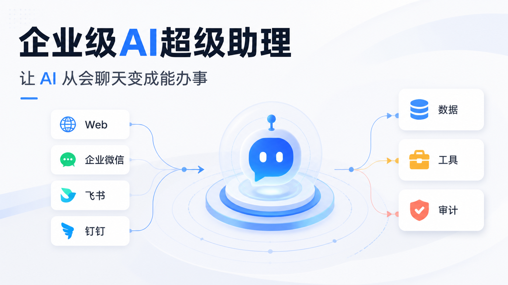

标题：企业级AI超级助理

副标题：让 AI 从会聊天变成能办事

讲稿：

> 今天大部分企业已经试过大模型，但真正落地时会遇到一个问题：模型会回答，但不一定能办事。我们做的不是一个普通聊天机器人，而是一位企业级AI超级助理。它能接入企业渠道、理解业务意图、调用内部工具、遵守权限规则，并把每一次执行过程记录下来。

生成提示词：

```text
Create a 16:9 B2B technology presentation cover.
Chinese title: 企业级AI超级助理
Subtitle: 让 AI 从会聊天变成能办事
Show employee chat channels connected to business systems through a central intelligent runtime platform.
Style: clean enterprise SaaS infographic, white background, charcoal text, blue/green/amber/coral accents.
Avoid logos, tiny text, watermark.
```

## 02. 客户痛点

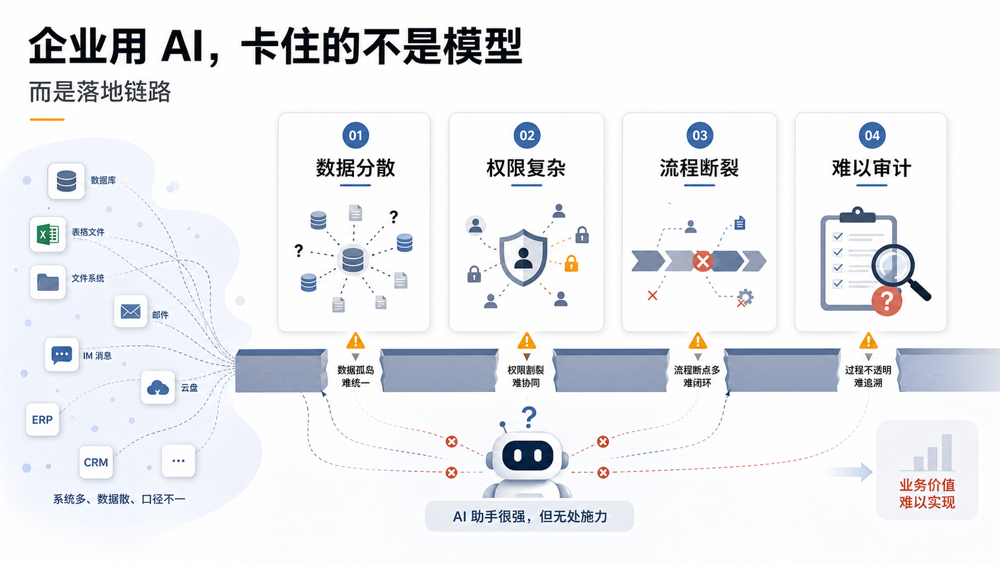

标题：企业用 AI，卡住的不是模型，而是落地链路

核心信息：

- 数据分散
- 权限复杂
- 流程断裂
- 难以审计

讲稿：

> 很多客户以为问题是模型不够聪明，但真正的问题是企业链路太复杂。一个销售问库存，一个店总问毛利，一个财务问报销政策，背后涉及的权限、数据源、流程和责任完全不同。所以企业需要的不是“更会说话的 AI”，而是一个能进入业务现场的 Agent 系统。

生成提示词：

```text
Create a 16:9 enterprise workflow pain point infographic.
Chinese title: 企业用 AI，卡住的不是模型
Subtitle: 而是落地链路
Four pain blocks: 数据分散, 权限复杂, 流程断裂, 难以审计.
Show scattered systems and broken workflow lines.
Style: polished executive sales deck, white background, restrained warning accents.
```

## 03. 产品总览

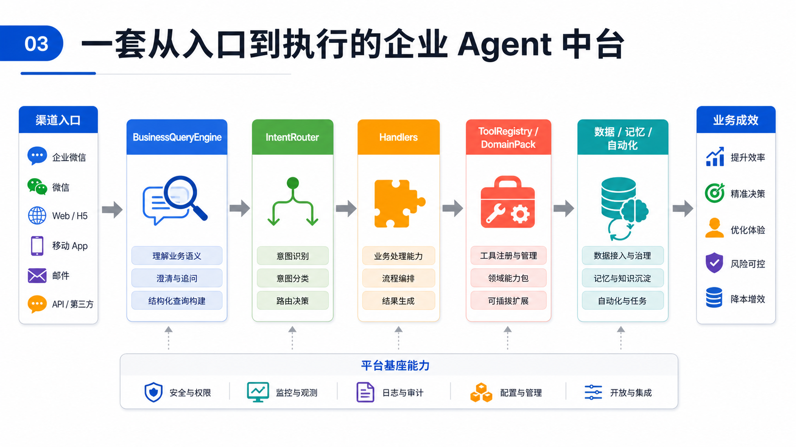

标题：一套从入口到执行的企业 Agent 中台

主链路：

```text
渠道入口 -> BusinessQueryEngine -> IntentRouter -> Handlers
-> ToolRegistry / DomainPack -> 数据 / 记忆 / 自动化
```

讲稿：

> 我们的平台可以理解成一个智能业务中台。员工从 Web、企业微信、飞书、钉钉、Webhook 或 Cron 进入。系统先识别用户身份和上下文，再判断意图，选择对应的处理器，最后调用企业工具和数据完成任务。每一步都有权限控制、日志记录、追踪和演化机制。

生成提示词：

```text
Create a 16:9 horizontal architecture overview.
Chinese title: 一套从入口到执行的企业 Agent 中台
Flow modules: 渠道入口 -> BusinessQueryEngine -> IntentRouter -> Handlers -> ToolRegistry / DomainPack -> 数据 / 记忆 / 自动化.
Use large readable blocks and arrows.
Style: clean SaaS architecture infographic.
```

## 04. 统一接入层

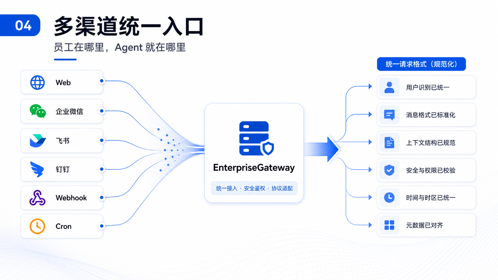

标题：多渠道统一入口

副标题：员工在哪里，Agent 就在哪里

关键模块：`EnterpriseGateway`

讲稿：

> 企业员工不会只在一个入口工作。销售可能在企业微信，管理层可能在 Web 看报表，系统任务可能来自定时巡检。所以我们设计了统一入口层，把不同渠道的消息标准化成同一种请求。后面无论是聊天、自动化任务、Webhook 事件，都走同一套 Agent Runtime。

比方：

> 它像机场的不同登机口。入口可以很多，但进入候机区后，调度规则是统一的。

生成提示词：

```text
Create a 16:9 unified channel access infographic.
Title: 多渠道统一入口
Subtitle: 员工在哪里，Agent 就在哪里
Channels: Web, 企业微信, 飞书, 钉钉, Webhook, Cron converge into EnterpriseGateway.
Show normalized request lines flowing out.
No real logos.
```

## 05. BusinessQueryEngine

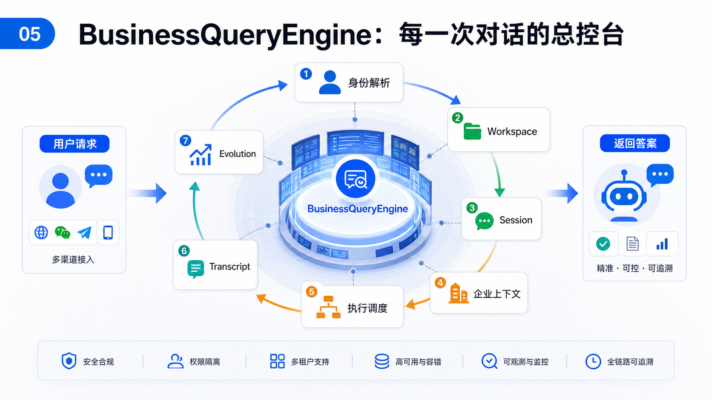

标题：BusinessQueryEngine：每一次对话的总控台

生命周期：

```text
身份解析 -> Workspace -> Session -> 企业上下文
-> 执行调度 -> Transcript -> Evolution
```

讲稿：

> BusinessQueryEngine 是整个平台的总控台。它不直接回答问题，而是保证每一次请求都被正确处理：这个人是谁、他的工作区在哪里、上一次聊到哪、这次需要带什么企业上下文、执行过程如何记录、结果是否触发后续学习。它解决的是企业 Agent 最核心的问题：不能只会回答，还要可追踪、可恢复、可审计、可演化。

比方：

> 如果把 Agent 比作一家智能办事大厅，BusinessQueryEngine 就是大厅经理。它负责登记来访者、确认权限、调取档案、分配窗口、记录办理过程，最后把结果交还给用户。

例子：

```text
用户问：汉EV 卖得还行但毛利好像不太行，看下原因。

BusinessQueryEngine 会先：
1. 确认用户身份
2. 找到用户 workspace
3. 读取会话上下文
4. 加载企业背景
5. 记录 turn_start
6. 交给执行层
7. 记录结果摘要
8. 触发使用统计和演化
```

生成提示词：

```text
Create a 16:9 control room workflow infographic.
Title: BusinessQueryEngine：每一次对话的总控台
Central hub: BusinessQueryEngine.
Surrounding lifecycle steps: 身份解析, Workspace, Session, 企业上下文, 执行调度, Transcript, Evolution.
Show request-to-answer loop.
```

## 06. IntentRouter + Handlers

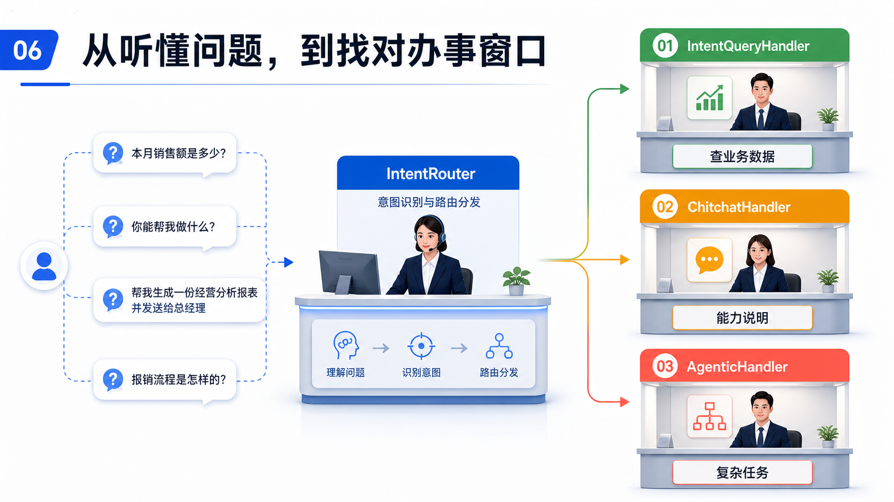

标题：从听懂问题，到找对办事窗口

分工：

- `IntentRouter`：判断问题属于哪一类
- `IntentQueryHandler`：查业务数据
- `ChitchatHandler`：能力说明和闲聊
- `AgenticHandler`：复杂任务规划和多工具执行

讲稿：

> 用户的一句话可能是查数据、问制度、闲聊、创建任务，也可能是一个复杂目标。IntentRouter 负责判断这句话属于哪一类，Handlers 负责真正办事。这样系统不会把所有逻辑塞进一个大模型里，而是把不同类型的问题交给最合适的处理器。

比方：

> IntentRouter 像医院分诊台，Handlers 像不同科室。发烧去内科，拍片去影像科，开药去药房。Agent 也是一样：查销量走查询 Handler，复杂自动化走 Agentic Handler，闲聊走 Chitchat Handler。

例子：

```text
本月各门店汉EV毛利排名。
-> IntentQueryHandler

你能做什么？
-> ChitchatHandler

每天早上 9 点帮我检查库存异常，有问题发企业微信。
-> AgenticHandler
```

生成提示词：

```text
Create a 16:9 enterprise service desk triage infographic.
Title: 从听懂问题，到找对办事窗口
User questions flow into IntentRouter, then branch to IntentQueryHandler, ChitchatHandler, AgenticHandler.
Labels: 查业务数据, 能力说明, 复杂任务.
```

## 07. ToolRegistry

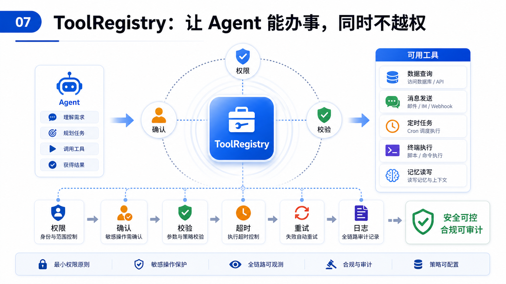

标题：ToolRegistry：让 Agent 能办事，同时不越权

治理点：

- 权限
- 确认
- 校验
- 超时
- 重试
- 日志

讲稿：

> 企业 Agent 不能随便调用工具。查数据、发消息、创建任务、执行终端命令、设置自动化，这些能力都有风险。ToolRegistry 就是统一的工具治理层：它让 Agent 能调用工具，但每一次调用都经过权限、确认、超时、重试和日志记录。

比方：

> 它像企业里的工具库和安全员。员工可以借设备，但要看有没有权限；危险设备要主管确认；设备坏了要记录；操作超时要中断。

例子：

```text
用户说：帮我创建一个每天巡检库存的任务。

系统先检查：
1. 用户有没有 cron.create 权限
2. 参数是否合法
3. 是否需要确认
4. 执行是否超时
5. 结果是否写入 trace
```

生成提示词：

```text
Create a 16:9 governed tool execution infographic.
Title: ToolRegistry：让 Agent 能办事，同时不越权
Central ToolRegistry connected to data query, messaging, cron, terminal, memory.
Governance checkpoints: 权限, 确认, 校验, 超时, 重试, 日志.
```

## 08. DomainPack

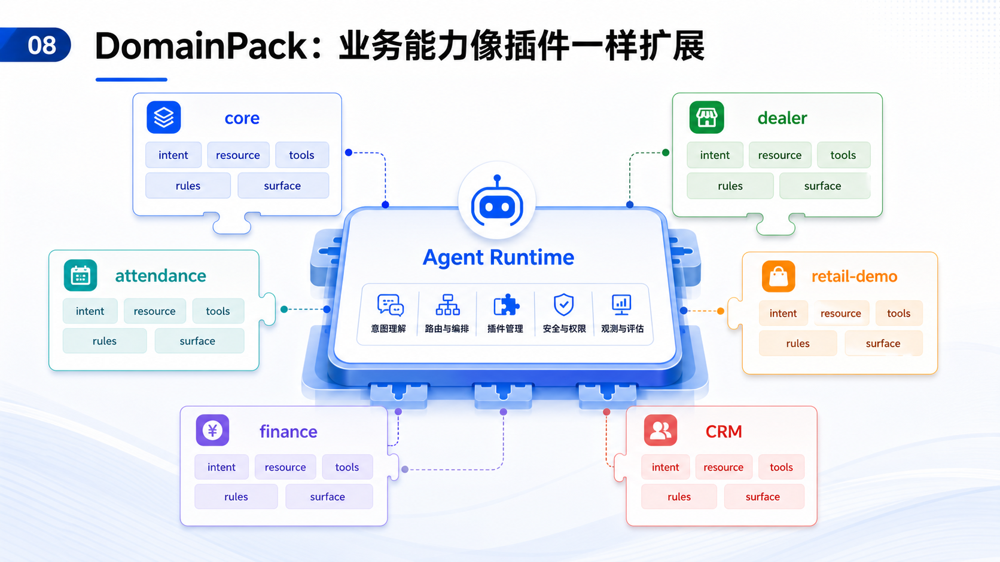

标题：DomainPack：业务能力像插件一样扩展

业务插件：

- `core`
- `dealer`
- `attendance`
- `retail-demo`
- 未来可扩展：`finance`, `CRM`, `HR`, `supply-chain`

讲稿：

> 企业业务会不断变化，所以平台不能写死在某一个场景里。DomainPack 是我们的业务扩展机制。一个新业务域可以声明自己的意图、数据资源、查询适配器、确定性规则、工具、权限和界面组件。这样客户后续要扩展新业务，不需要重写整个系统。

比方：

> 它像手机的 App Store。底层系统不变，但可以安装不同业务应用：销售分析、请假审批、库存巡检、财务报销、知识问答。

生成提示词：

```text
Create a 16:9 modular plugin architecture infographic.
Title: DomainPack：业务能力像插件一样扩展
Central Agent Runtime with plugin cards: core, dealer, attendance, retail-demo, finance, CRM.
Capability chips: intent, resource, tools, rules, surface.
```

## 09. 持续协作

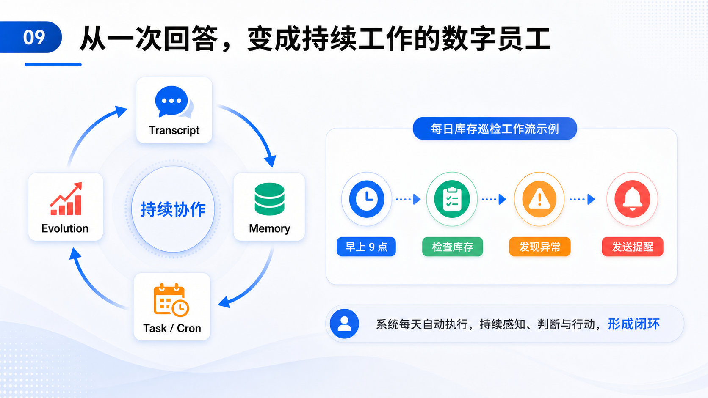

标题：从一次回答，变成持续工作的数字员工

闭环：

```text
Transcript -> Memory -> Task / Cron -> Evolution
```

讲稿：

> 普通聊天机器人只处理当前这一句话。企业 Agent 必须能持续工作：记住上下文，跟进任务，定时检查，复盘自己哪里做得好或不好。所以系统里有 transcript、memory、task、cron 和 evolution。它们让 Agent 从“一问一答”变成“持续协作”。

比方：

> 一个新人助理只会你问一句答一句。一个成熟助理会记笔记、建待办、定提醒、复盘流程，下次做得更好。这就是记忆和演化层的价值。

例子：

```text
每天早上 9 点检查库存超过 60 天的车。
发现异常后，通过企业微信提醒店总。
```

生成提示词：

```text
Create a 16:9 continuous collaboration loop infographic.
Title: 从一次回答，变成持续工作的数字员工
Loop nodes: Transcript, Memory, Task / Cron, Evolution.
Center: 持续协作.
Example timeline: 早上 9 点 -> 检查库存 -> 发现异常 -> 发送提醒.
```

## 10. 安全、治理与可观测

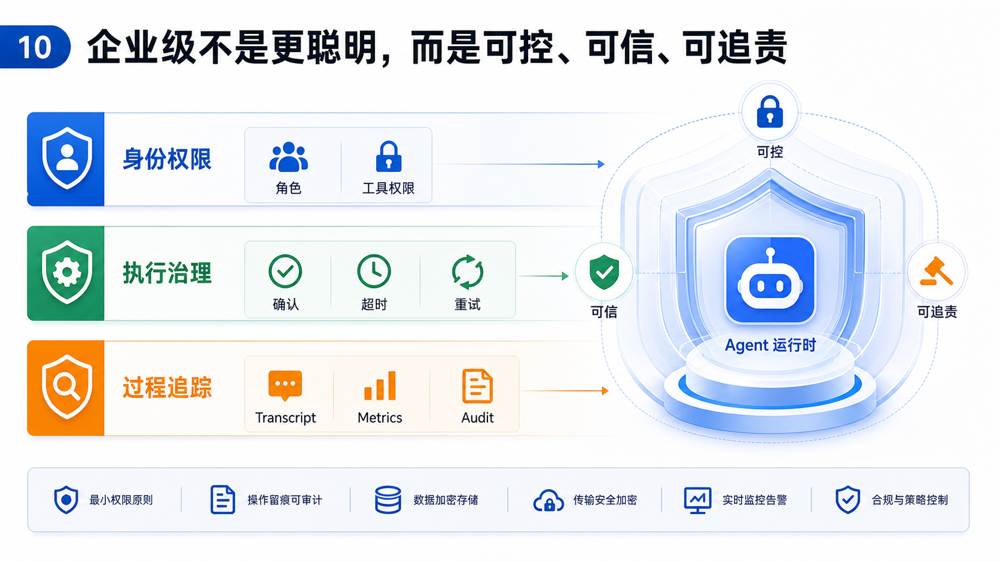

标题：企业级不是更聪明，而是可控、可信、可追责

三层护栏：

- 身份权限
- 执行治理
- 过程追踪

讲稿：

> 客户真正担心的不是 AI 不会回答，而是 AI 乱回答、乱操作、出错没人知道。我们把权限、审计和观测放在运行时底层。每一轮对话、每一次工具调用、每一次自动化执行，都可以追踪和复盘。

比方：

> 这就像银行柜台系统。不是员工会操作就够了，还要有权限、复核、流水号、操作日志和风控规则。

生成提示词：

```text
Create a 16:9 enterprise governance infographic.
Title: 企业级不是更聪明，而是可控、可信、可追责
Three guardrail layers: 身份权限, 执行治理, 过程追踪.
Keywords: 角色, 工具权限, 确认, 超时, 重试, Transcript, Metrics, Audit.
```

## 11. 客户价值

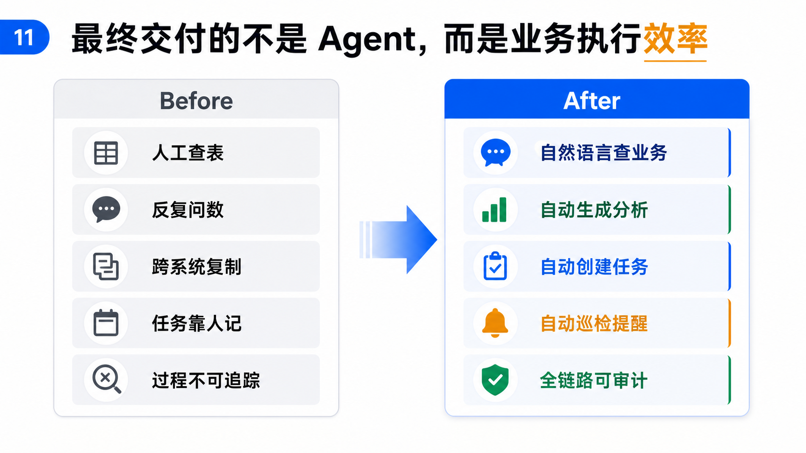

标题：最终交付的不是 Agent，而是业务执行效率

Before：

- 人工查表
- 反复问数
- 跨系统复制
- 任务靠人记
- 过程不可追踪

After：

- 自然语言查业务
- 自动生成分析
- 自动创建任务
- 自动巡检提醒
- 全链路可审计

讲稿：

> 这个平台最终带来的不是“多一个聊天入口”，而是让企业把大量重复的查询、分析、提醒、跟进和制度问答交给 Agent。员工不用记系统入口，管理者不用反复追问数据，IT 不用为每个小需求单独开发页面。

生成提示词：

```text
Create a 16:9 before-after executive infographic.
Title: 最终交付的不是 Agent，而是业务执行效率
Before: 人工查表, 反复问数, 跨系统复制, 任务靠人记, 过程不可追踪.
After: 自然语言查业务, 自动生成分析, 自动创建任务, 自动巡检提醒, 全链路可审计.
```

## 12. 落地路径

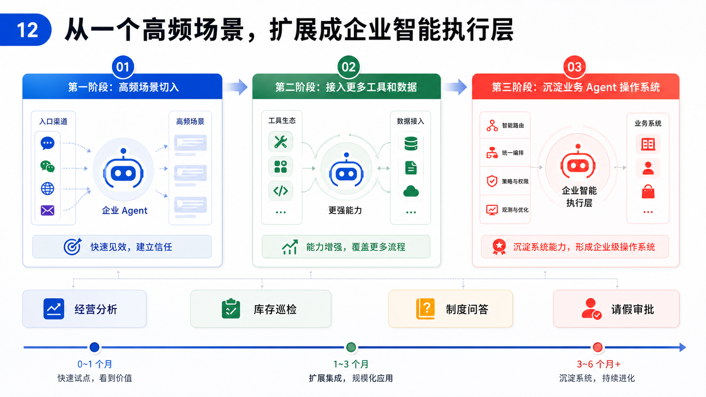

标题：从一个高频场景，扩展成企业智能执行层

三阶段：

```text
第一阶段：高频场景切入
第二阶段：接入更多工具和数据
第三阶段：沉淀业务 Agent 操作系统
```

讲稿：

> 我们的定位不是做一个单点 AI 应用，而是做企业 Agent 的运行时底座。第一阶段可以从一个高频场景切入，比如经销商经营分析、库存巡检、制度问答或请假审批。第二阶段把更多工具、数据和业务域接进来。最终，它会成为企业内部的智能执行层。

生成提示词：

```text
Create a 16:9 phased rollout roadmap infographic.
Title: 从一个高频场景，扩展成企业智能执行层
Milestones: 第一阶段：高频场景切入, 第二阶段：接入更多工具和数据, 第三阶段：沉淀业务 Agent 操作系统.
Examples: 经营分析, 库存巡检, 制度问答, 请假审批.
```

## 推荐讲述顺序

```text
1. 先讲企业为什么不能直接用普通 ChatGPT
2. 再讲企业 Agent 必须具备六种能力
3. 然后讲你的平台如何一层层解决这些问题
4. 用一个真实业务例子串起来
5. 最后展示落地路径，降低客户决策压力
```

## 一句话收口

> 前面几层让 Agent 接得进来，中间几层让 Agent 办得了事，后面几层让 Agent 可控、可扩展、可持续。
